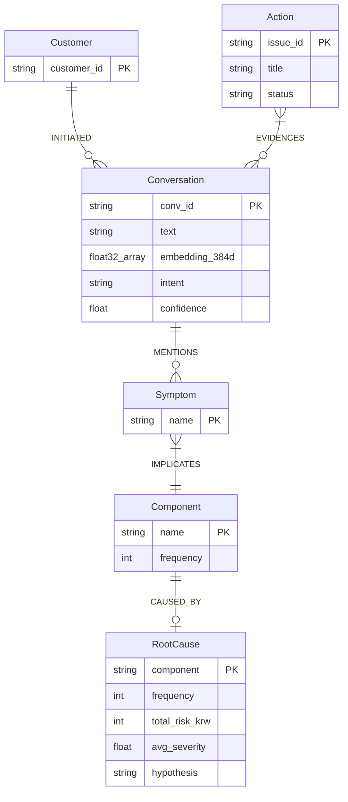
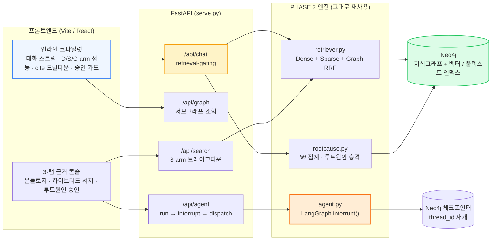

# 채널톡 VOC 인텔리전스 부서 — 루트원인 GraphRAG 엔진 & Codex 플러그인

> **인사이트에서 실전 액션 배포까지.** 하루 수천 건의 채널톡 고객 상담 대화를 자동으로 수집하고, **Neo4j 지식그래프**로 엮어 ₩ 매출 손실액과 루트원인을 탐지한 뒤, **LangGraph 인간 승인 게이트**를 거쳐 **실시간 GitHub Issue/PR 및 Jira 티켓**을 자동 발행하는 에이전틱 AI 부서 시스템.

[](https://channel-voc-demo.vercel.app/)
[](pyproject.toml)
[](src/graph/agent.py)
[](src/graph/schema.cypher)
[](src/graph/llm.py)
[](src/graph/llm.py)
[](src/graph/serve.py)
[](web/src/App.tsx)

---

### 웹 대시보드 데모 (Vercel Live)

> 🔗 **[https://channel-voc-demo.vercel.app](https://channel-voc-demo.vercel.app)**
> 
> *위 링크를 클릭하면 별도 환경 구축 없이 브라우저에서 6단계 엔진 프로세스와 하이브리드 검색을 직접 테스트해 보실 수 있습니다.*

---

## 1. 프로젝트 발전 과정 (해커톤 제출작 → GraphRAG 엔진 → 운영자 코파일럿)

초기 AX 해커톤 제출작(PHASE 1)을 지식그래프·AI 에이전트 엔진(PHASE 2)으로 고도화하고, 다시 운영자가 채널톡 데스크에서 실시간으로 질문하는 대화형 코파일럿(PHASE 3)으로 발전시킨 프로젝트입니다.

```mermaid
flowchart LR
    subgraph Phase1 ["PHASE 1: AX 해커톤 제출작"]
        direction TB
        P1_1["순차적 자동 분석\n(대화 수집 → 분석 → 티켓)"]
        P1_2["머신러닝 기반 의도 분류\n(Scikit-Learn)"]
        P1_3["기본 GitHub / Jira 연동"]
    end

    Phase1 -->|"지식그래프 & 에이전트"| Phase2

    subgraph Phase2 ["PHASE 2: 루트원인 GraphRAG 엔진"]
        direction TB
        P2_1["AI 핵심 신호 추출\n(증상 · 부품 · 심각도)"]
        P2_2["지식그래프 순회 & 집계\n(8건 이상 승격 · 손실액)"]
        P2_3["3중 하이브리드 & 사람 승인\n(LangGraph Gate)"]
    end

    Phase2 -->|"실시간 대화형 전환"| Phase3

    subgraph Phase3 ["PHASE 3: 운영자 코파일럿 & 콘솔"]
        direction TB
        P3_1["FastAPI 실시간 API\n(챗봇 · 그래프 · 검색 · 에이전트)"]
        P3_2["Retrieval-Gating\n(3분기 정직한 거절 게이트)"]
        P3_3["Vite/React 인라인 코파일럿\n& 3-탭 근거 콘솔"]
    end

    style Phase1 fill:#f8fafc,stroke:#cbd5e1
    style Phase2 fill:#f0fdf4,stroke:#86efac
    style Phase3 fill:#eff6ff,stroke:#93c5fd
```



### PHASE 1 vs. PHASE 2 핵심 비교

| 비교 항목 | PHASE 1 (해커톤 제출작) | PHASE 2 (고도화 엔진) |
|---|---|---|
| **아키텍처** | 순차 실행 스크립트 | **LangGraph AI 에이전트** (승인 대기 및 상태 관리) |
| **분석 방식** | 키워드 중심 단순 분류 | **LLM 구조화 추출**: 대화 내용에서 증상·부품·심각도 정밀 분석 |
| **데이터 저장** | 정적 JSON 파일 | **Neo4j 지식그래프**: 고객-대화-증상-부품 연결 관계망 구축 |
| **문제 탐지** | 대표 문장 3건 추론 | **그래프 자동 집계**: 동일 부품 문제 8건 이상 시 루트원인 자동 지정 및 손실액 추정 |
| **근거 검색** | 문자열 매칭 | **3중 하이브리드 검색**: 의미 검색 + 키워드 검색 + 그래프 연관 검색 융합 |
| **안전 장치** | 조건문 검사 | **인간 승인 게이트**: 사람의 최종 승인 전까지 배포 일시정지 |
| **추적성** | 대화 ID 단순 기록 | **그래프 추적**: 생성된 이슈와 원본 대화 간 연관 관계 형성 |
| **화면 구성** | 정적 HTML 대시보드 | **6가지 인터랙티브 대시보드** (6단계 프로세스 뷰어, 원문 보기, 실시간 검색) |

---

## 2. PHASE 2 — 루트원인 GraphRAG 아키텍처

PHASE 2는 단순 텍스트 분류기를 넘어 **에이전틱 지식그래프 루트원인 탐지 엔진**으로 동작합니다.

### 1. 엔드투엔드 시스템 다이어그램 (System Flow)

```mermaid
flowchart LR
    subgraph DataIngestion ["1. 데이터 수집 & 신호 추출"]
        direction TB
        RAW["1,200건 고객 대화 데이터 (Bitext CS)"] --> EXTRACT["LLM Function Calling 추출기\n(extract.py)"]
        EXTRACT --> SIGNALS["구조화 신호\n(Intent, Symptom, Component, Severity)"]
    end

    subgraph KnowledgeGraph ["2. Neo4j 지식그래프 & 임베딩"]
        direction TB
        SIGNALS --> KG_LOAD["Neo4j MERGE 로더\n(load.py)"]
        KG_LOAD --> DENSE["FastEmbed ONNX 384d 벡터 인덱스"]
        KG_LOAD --> SPARSE["Lucene Full-text 인덱스"]
        KG_LOAD --> GRAPH_NODES["지식그래프 노드/엣지 구축\n(Customer→Conv→Symptom→Component)"]
    end

    subgraph RootCauseEngine ["3. 루트원인 탐지 & GraphRAG"]
        direction TB
        GRAPH_NODES --> CYPHER["Cypher 순회 엔진\n(rootcause.py)"]
        CYPHER --> PROMOTION{"동일 부품 지목\n8건 이상?"}
        PROMOTION -- YES --> RC_PROMOTE["RootCause 노드 승격\n+ ₩ 매출 손실액 집계"]
        
        RC_PROMOTE --> RRF_RETRIEVER["3중 하이브리드 검색 & RRF 융합\n(retriever.py)"]
        DENSE --> RRF_RETRIEVER
        SPARSE --> RRF_RETRIEVER
        RRF_RETRIEVER --> DRAFTER["팩트 근거 이슈 초안 작성\n(drafter.py)"]
    end

    subgraph HumanInTheLoop ["4. LangGraph 승인 게이트 & 배포"]
        direction TB
        DRAFTER --> INTERRUPT["LangGraph interrupt()\n인간 승인 대기 노드 (agent.py)"]
        INTERRUPT --> APPROVAL{"사람의 승인 결정"}
        APPROVAL -- Approved --> DISPATCH["GitHub Issue 배포 & Provenance 기록\n(dispatch.py)"]
        APPROVAL -- Rejected --> REJECT["배포 취소 & 로깅"]
        
        DISPATCH --> NEO4J_EDGE["Neo4j 출처 엣지 생성\n(Action)-[:EVIDENCES]->(Conv)"]
        DISPATCH --> DASHBOARD["out/dashboard.html 생성\n(6가지 Visual)"]
    end

    DataIngestion --> KnowledgeGraph --> RootCauseEngine --> HumanInTheLoop

    style RAW fill:#f9f9fb,stroke:#d1d5db,stroke-width:1px
    style EXTRACT fill:#eff6ff,stroke:#3b82f6,stroke-width:1.5px
    style CYPHER fill:#fef3c7,stroke:#f59e0b,stroke-width:1.5px
    style INTERRUPT fill:#ffedd5,stroke:#f97316,stroke-width:2px
    style DISPATCH fill:#dcfce7,stroke:#22c55e,stroke-width:2px
```



### 2. Neo4j 지식그래프 데이터 모델 (ERD)



---

## 3. PHASE 3 — 운영자 인라인 코파일럿 & 3-탭 근거 콘솔

PHASE 2가 `run.py` 한 번으로 그래프를 만들고 정적 대시보드를 굽는 **배치 파이프라인**이었다면, PHASE 3는 운영자가 채널톡 데스크에서 **같은 지식그래프에 직접 질문하는 대화형 코파일럿**입니다. 배치 산출물을 읽는 대신, 그래프를 실시간으로 조회하고 답변 옆에 근거를 펼쳐 봅니다.

전환의 축은 세 가지입니다.

- `stdlib http.server` → **FastAPI**. 기존 검색 엔드포인트를 옮기고 `/api/chat`·`/api/graph`·`/api/search`·`/api/agent` 라우터를 같은 앱에 붙였습니다. 라우터는 `src/graph/*`를 감싼 얇은 래퍼라 엔진 로직이 중복되지 않습니다.
- LangGraph `SqliteSaver` → **Neo4j 커스텀 체크포인터**. 로컬 영구 디스크 요건이 사라져 서버리스 콜드스타트 사이에도 `thread_id`로 승인 대기 상태를 재개합니다.
- 정적 HTML → **Vite/React 프론트**. 색·타이포·간격을 `tokens.css` 한 곳에 정본화하고 컴포넌트는 `var(--token)`만 참조합니다.

### 1. 요청 아키텍처 (Request Flow)



### 2. Retrieval-Gating — 근거 없이는 답하지 않는다

챗봇 답변은 LLM이 자유 생성하지 않습니다. `hybrid_search`로 근거를 먼저 조회하고, **루트원인 승격 임계값(8건)**을 신뢰 경계로 세 갈래로 나눕니다. 답변 문장은 그래프의 실제 ₩·frequency 값으로 조립되므로 근거 밖을 지어낼 수 없습니다.

| 근거 상태 | gate | 응답 |
|---|---|---|
| 검색 결과 0건 | `refuse` | 정직한 거절 + 답할 수 있는 질문 칩 |
| 근거는 있으나 컴포넌트 미승격 (< 8건) | `low_confidence` | ⚠ 헤지 답변(참고용) + 근거 대화 링크 |
| 컴포넌트가 루트원인으로 승격 (≥ 8건) | `answer` | 실제 ₩ 손실 · 회수액 · confidence로 구성 |

응답에는 `subgraph_ref`(근거 서브그래프)와 히트별 `evidence`(D/S/G arm 태그 + 점수)가 함께 실려, 답변 오른쪽 패널에 근거 그래프와 검색 히트가 그대로 펼쳐집니다. 답변 속 `rc_billing`·`conv_00042` 같은 ID는 클릭하면 후속 질문으로 이어지는 드릴다운 링크가 됩니다.

### 3. 화면 — 코파일럿 ↔ 근거 콘솔

- **인라인 코파일럿**: 질문을 던지면 답변 전에 Dense → Sparse → Graph 세 검색 arm이 순서대로 점등해 3중 하이브리드 과정을 그대로 보여주고, 답변과 함께 근거 서브그래프·승인 카드가 붙습니다. 루트원인 답변의 승인 카드에서 승인하면 `/api/agent/dispatch`로 이어져 GitHub Issue가 발행됩니다.
- **3-탭 근거 콘솔** (근거 패널의 "⤢ 탐색"으로 진입): ① 온톨로지 그래프 — 노드 클릭으로 1/2-hop 확장, ② 하이브리드 서치 — Dense · Sparse(BM25) · Graph 3컬럼과 RRF 융합을 나란히, ③ 루트원인 승인 센터 — 카드별·일괄 승인/반려.

### 4. 배포 (Vercel)

프론트(정적)와 FastAPI(서버리스 Python 함수)를 한 프로젝트에 올립니다. 로컬 `fastembed`(ONNX 런타임 + 모델)는 서버리스 번들 한계를 넘기므로, 쿼리 임베딩만 **동일 모델·동일 384d의 호스티드 엔드포인트**로 돌려 번들에서 걷어냈습니다 — 차원이 같아 Neo4j 벡터 인덱스는 재색인이 필요 없습니다. 환경 변수와 배포 절차는 [`docs/dev/deploy.md`](docs/dev/deploy.md)에 정리돼 있습니다.

---

## 4. 정직한 벤치마크: Scikit-Learn vs. LLM

600건의 격리된 고객 대화 데이터셋에 대해 27개 **Intent(의도)** 분류 과제를 평가했습니다:

| 평가 모델 | Cohen's $\kappa$ | Macro-$F_1$ | 처리 속도 | API 비용 | 주요 역할 |
|---|---|---|---|---|---|
| **Scikit-Learn (TF-IDF + LogReg)** | **0.971** | **0.972** | 초당 ~700건 | **₩0** | **빠른 1차 라벨러** |
| **LLM (OpenRouter GPT-4o-mini)** | 0.864 | 0.868 | 초당 ~1.2건 | 건당 $0.0003 | **그래프 신호 추출기** |

### 포트폴리오 서사 (Insight)
1. **Scikit-Learn**: 속도가 초고속이고 비용이 0원인 단순 Intent 분류기($\kappa = 0.971$)로 활용.
2. **LLM**: TF-IDF가 생성할 수 없는 **복합 구조 신호**(`Symptom` $\rightarrow$ `Component` $\rightarrow$ `Severity` $\rightarrow$ `Confidence`)를 지식그래프용으로 추출하는 데 사용.

---

## 5. 인터랙티브 대시보드 산출물 (`out/dashboard.html`)

`out/dashboard.html`은 단일 자립형 HTML 파일로, 외부 네트워크 요청 없이 동작하는 **6가지 비주얼 화면**을 포함합니다:

1. **6단계 인터랙티브 엔진 스테퍼**: Step 1~6 과정(대화 원문 $\rightarrow$ JSON 추출 $\rightarrow$ Cypher 쿼리 $\rightarrow$ GraphRAG 근거 $\rightarrow$ 승인 게이트 $\rightarrow$ GitHub Issue 배포)을 시각적으로 확인.
2. **LangGraph 플로우 & 실시간 활동 피드**: 노드 실행 상태 및 승인 대기(`interrupt()`) 지점 시각화.
3. **인터랙티브 Neo4j 지식그래프**: 노드 클릭 시 장애 유발 지점과 매출 손실 경로 하이라이트.
4. **GraphRAG 근거 카드**: 대화 원문 열람 및 인용 대화 ID 확인.
5. **정직한 벤치마크 차트**: Scikit-Learn vs LLM 성과 비교.
6. **₩ 손실 Sankey 다이어그램 & 라이브 검색 플레이그라운드**: 부품별 손실 흐름 및 3중 파이프라인 라이브 검색.

---

## 6. 프로젝트 디렉토리 구조

```text
├── README.md                      # 프로젝트 메인 문서
├── pyproject.toml / uv.lock       # 파이썬 의존성 관리
├── .env.example                   # 환경 변수 템플릿
├── out/
│   ├── dashboard.html             # 6가지 시각화가 담긴 자립형 HTML 산출물
│   ├── manifest.json              # 실행 리포트
│   ├── graph_snapshot.json        # 그래프 시각화 및 검색 코퍼스 데이터
│   └── benchmark.json             # Scikit-Learn vs LLM 평가 결과
├── web/                           # PHASE 3: Vite/React 프론트 (인라인 코파일럿 + 3-탭 콘솔)
│   ├── src/components/            # ChatStream · EvidencePanel · ApprovalCard · ConfidenceGate ...
│   ├── src/console/               # 온톨로지 그래프 / 하이브리드 서치 / 루트원인 승인 탭
│   └── src/api/                   # chat · graph · agent · search API 클라이언트
├── api/index.py                   # PHASE 3: Vercel 서버리스 진입점 (FastAPI ASGI 재노출)
├── requirements.txt / vercel.json # 서버리스 배포 설정
├── tokens.css                     # 디자인 토큰 정본 (프론트가 import)
├── study/                         # GraphRAG 학습용 노트북
├── src/
│   ├── server/routers/            # PHASE 3: FastAPI 라우터 (chat · graph · search · agent)
│   ├── graph/                     # PHASE 2: 루트원인 GraphRAG 엔진
│   │   ├── run.py                 # 배치 실행 진입점
│   │   ├── serve.py               # FastAPI 앱 (라이브 검색 + /api/* 라우터 마운트)
│   │   ├── agent.py               # LangGraph StateGraph & interrupt() 게이트
│   │   ├── checkpoint_neo4j.py    # Neo4j 커스텀 체크포인터 (thread_id 재개)
│   │   ├── retriever.py           # 3중 하이브리드 검색 (Dense + Sparse + Graph RRF)
│   │   ├── rootcause.py           # Cypher 순회 및 ₩ 손실 집계
│   │   ├── extract.py             # LLM Function Calling 신호 추출
│   │   ├── llm.py                 # 임베딩/챗 클라이언트 (fastembed | 호스티드)
│   │   ├── load.py / db.py        # Neo4j 지식그래프 적재 및 드라이버
│   │   └── dashboard.py           # 대시보드 HTML 생성기
│   └── pipeline/                  # PHASE 1: 해커톤 초기 파이프라인
│       ├── run.py                 # 해커톤 파이프라인 실행
│       ├── analyze.py / ingest.py # Scikit-Learn 분류기 및 대화 적재
│       └── dispatch.py            # 이슈 생성기
└── data/                          # 1,200건 고객 대화 데이터 및 캐시
```

---

## 7. 라이선스 및 데이터 출처

- **데이터셋**: Bitext Customer Support Dataset ([CDLA-Sharing-1.0](https://cdla.dev/sharing-1-0/))
- **라이선스**: MIT License
