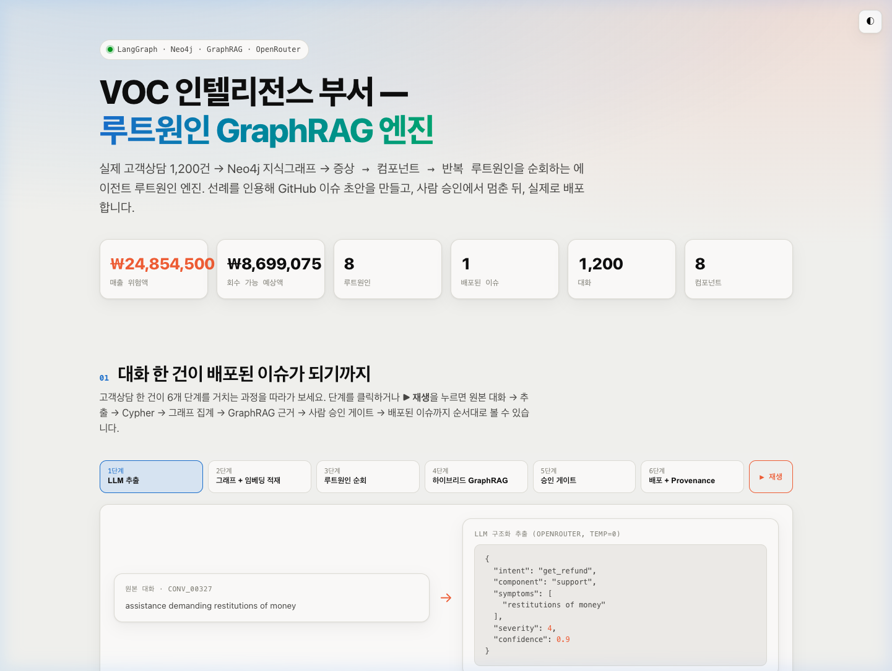
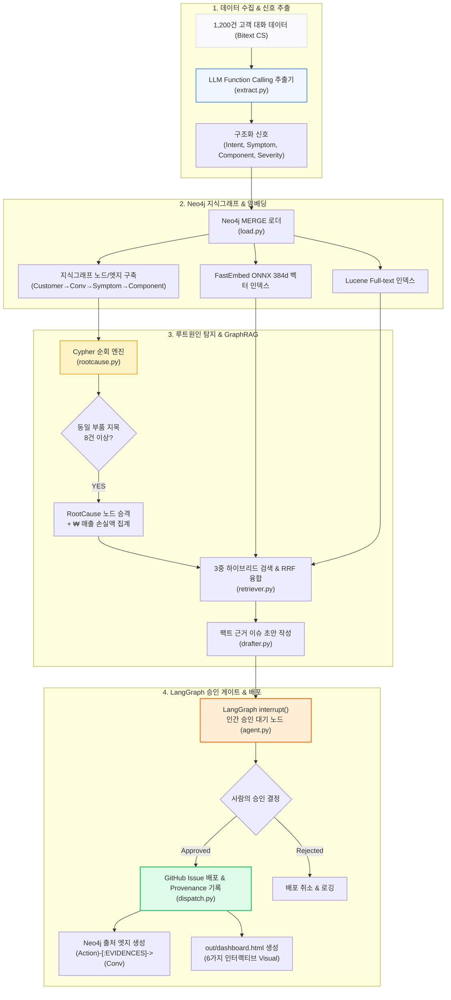
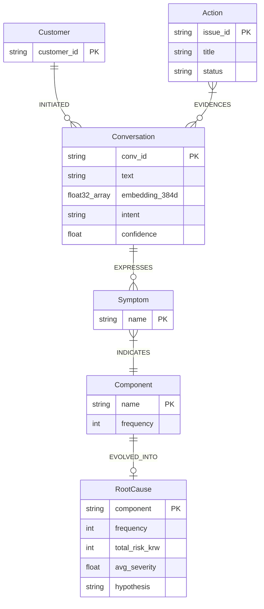

# 채널톡 VOC 인텔리전스 부서 — 루트원인 GraphRAG 엔진 & Codex 플러그인

> **인사이트에서 실전 액션 배포까지.** 하루 수천 건의 채널톡 고객 상담 대화를 자동으로 수집하고, **Neo4j 지식그래프**로 엮어 ₩ 매출 손실액과 루트원인을 탐지한 뒤, **LangGraph 인간 승인 게이트**를 거쳐 **실시간 GitHub Issue/PR 및 Jira 티켓**을 자동 발행하는 에이전틱 AI 부서 시스템.

[](https://channel-voc-demo.vercel.app/)
[](pyproject.toml)
[](src/graph/agent.py)
[](src/graph/schema.cypher)
[](src/graph/llm.py)
[](src/graph/llm.py)

---

### 웹 대시보드 데모 (Vercel Live)

[](https://channel-voc-demo.vercel.app/)

> [https://channel-voc-demo.vercel.app](https://channel-voc-demo.vercel.app)
> 
> *상단 이미지 또는 링크를 클릭하면 별도 환경 구축 없이 브라우저에서 6단계 엔진 프로세스와 하이브리드 검색을 직접 테스트해 보실 수 있습니다.*

---

## 1. 핵심 개요: Dual Phase Evolution

본 프로젝트는 **AX 해커톤 제출작 (PHASE 1)**과 이를 바탕으로 고도화한 **포트폴리오 고도화 엔진 (PHASE 2)**을 포함하고 있습니다.

```
┌────────────────────────────────────────────────────────────────────────────────────────┐
│  PHASE 1: AX 해커톤 제출작 (Scikit-Learn 기반 룰베이스 파이프라인)                          │
│  - 5-Arm 파이프라인: Listen → Analyst → Triage/QA → Growth Ops → CSM Ops                 │
│  - 격리 데이터셋 검증 (Cohen's κ = 0.971) 및 근거 기반 ₩ 매출 손실 추정 모델                │
│  - 실제 GitHub Issue (#6), PR (#7), Jira 티켓 (KAN-2) MCP 실연동 배포                    │
└───────────────────────────────────────────┬────────────────────────────────────────────┘
                                            │  (포트폴리오 고도화 승격)
                                            ▼
┌────────────────────────────────────────────────────────────────────────────────────────┐
│  PHASE 2: 루트원인 GraphRAG 엔진 (LangChain · LangGraph · Neo4j · GraphRAG)              │
│  - LLM 구조화 추출 (Intent · Symptoms · Component · Severity · Confidence)              │
│  - Neo4j 지식그래프 순회 및 8건 이상 중복 지목 시 `RootCause` 승격 & ₩ 손실액 자동 집계      │
│  - 3중 하이브리드 GraphRAG (BGE-Small Dense + Lucene Sparse + Graph 1-hop) & RRF 융합     │
│  - LangGraph interrupt() 인간 승인 게이트 & 6가지 인터랙티브 대시보드 (`out/dashboard.html`) │
└────────────────────────────────────────────────────────────────────────────────────────┘
```

### Before (PHASE 1) vs. After (PHASE 2) 비교표

| 축 | PHASE 1 (해커톤 제출작) | PHASE 2 (포트폴리오 고도화) |
|---|---|---|
| **시스템 아키텍처** | 선형 스크립트 파이프라인 (5-Arm Orchestrator) | **LangGraph StateGraph** + SQLite 체크포인터 + `interrupt()` 게이트 |
| **신호 추출 방식** | TF-IDF + Scikit-Learn (단순 의도 분류) | **LLM Function Calling**: Intent, Symptoms, Component, Severity |
| **지식 저장소** | 정적 JSON 파일 (`analysis.json`) | **Neo4j 지식그래프** (Customer $\rightarrow$ Conv $\rightarrow$ Symptom $\rightarrow$ Component) |
| **루트원인 탐지** | 대표 문장 3건 추론 | **Cypher 순회 집계**: 동일 Component를 지목하는 대화 8건+ $\rightarrow$ `RootCause` 승격 |
| **검색 및 근거** | 정적 키워드 / 문자열 매칭 | **3중 하이브리드 검색**: BGE-Small Dense + Lucene Sparse + Graph 1-hop (RRF) |
| **안전 승인 장치** | 스크립트 임계치 조건문 | **LangGraph `interrupt()`**: 사람의 최종 승인 전까지 실행 일시정지 |
| **감사 추적성** | JSON 대화 ID 정적 참 | **Cypher 그래프 감사추적**: `(Action)-[:EVIDENCES]->(Conversation)` 엣지 연결 |
| **사용자 인터페이스** | 정적 HTML 대시보드 | **6가지 인터랙티브 대시보드** (6단계 스테퍼, 원문 보기, 라이브 검색) |

---

## 2. PHASE 2 — 루트원인 GraphRAG 아키텍처

PHASE 2는 단순 텍스트 분류기를 넘어 **에이전틱 지식그래프 루트원인 탐지 엔진**으로 동작합니다.

### 1. 엔드투엔드 시스템 다이어그램 (System Flow)



### 2. Neo4j 지식그래프 데이터 모델 (ERD)



---

## 3. 정직한 벤치마크: Scikit-Learn vs. LLM

600건의 격리된 고객 대화 데이터셋에 대해 27개 **Intent(의도)** 분류 과제를 평가했습니다:

| 평가 모델 | Cohen's $\kappa$ | Macro-$F_1$ | 처리 속도 | API 비용 | 주요 역할 |
|---|---|---|---|---|---|
| **Scikit-Learn (TF-IDF + LogReg)** | **0.971** | **0.972** | 초당 ~700건 | **₩0** | **빠른 1차 라벨러** |
| **LLM (OpenRouter GPT-4o-mini)** | 0.864 | 0.868 | 초당 ~1.2건 | 건당 $0.0003 | **그래프 신호 추출기** |

### 포트폴리오 서사 (Insight)
1. **Scikit-Learn**: 속도가 초고속이고 비용이 0원인 단순 Intent 분류기($\kappa = 0.971$)로 활용.
2. **LLM**: TF-IDF가 생성할 수 없는 **복합 구조 신호**(`Symptom` $\rightarrow$ `Component` $\rightarrow$ `Severity` $\rightarrow$ `Confidence`)를 지식그래프용으로 추출하는 데 사용.

---

## 4. 인터랙티브 대시보드 산출물 (`out/dashboard.html`)

`out/dashboard.html`은 단일 자립형 HTML 파일로, 외부 네트워크 요청 없이 동작하는 **6가지 비주얼 화면**을 포함합니다:

1. **6단계 인터랙티브 엔진 스테퍼**: Step 1~6 과정(대화 원문 $\rightarrow$ JSON 추출 $\rightarrow$ Cypher 쿼리 $\rightarrow$ GraphRAG 근거 $\rightarrow$ 승인 게이트 $\rightarrow$ GitHub Issue 배포)을 시각적으로 확인.
2. **LangGraph 플로우 & 실시간 활동 피드**: 노드 실행 상태 및 승인 대기(`interrupt()`) 지점 시각화.
3. **인터랙티브 Neo4j 지식그래프**: 노드 클릭 시 장애 유발 지점과 매출 손실 경로 하이라이트.
4. **GraphRAG 근거 카드**: 대화 원문 열람 및 인용 대화 ID 확인.
5. **정직한 벤치마크 차트**: Scikit-Learn vs LLM 성과 비교.
6. **₩ 손실 Sankey 다이어그램 & 라이브 검색 플레이그라운드**: 부품별 손실 흐름 및 3중 파이프라인 라이브 검색.

---

## 5. 프로젝트 디렉토리 구조

```text
├── README.md                      # 프로젝트 메인 문서
├── pyproject.toml / uv.lock       # 파이썬 의존성 관리
├── .env.example                   # 환경 변수 템플릿
├── out/
│   ├── dashboard.html             # 6가지 시각화가 담긴 자립형 HTML 산출물
│   ├── manifest.json              # 실행 리포트
│   ├── graph_snapshot.json        # 그래프 시각화 및 검색 코퍼스 데이터
│   └── benchmark.json             # Scikit-Learn vs LLM 평가 결과
├── src/
│   ├── graph/                     # PHASE 2: 루트원인 GraphRAG 엔진
│   │   ├── run.py                 # 실행 진입점
│   │   ├── serve.py               # 라이브 검색 로컬 HTTP 서버
│   │   ├── agent.py               # LangGraph StateGraph & interrupt() 게이트
│   │   ├── retriever.py           # 3중 하이브리드 검색 (Dense + Sparse + Graph RRF)
│   │   ├── rootcause.py           # Cypher 순회 및 ₩ 손실 집계
│   │   ├── extract.py             # LLM Function Calling 신호 추출
│   │   ├── load.py / db.py        # Neo4j 지식그래프 적재 및 드라이버
│   │   └── dashboard.py           # 대시보드 HTML 생성기
│   └── pipeline/                  # PHASE 1: 해커톤 초기 파이프라인
│       ├── run.py                 # 해커톤 파이프라인 실행
│       ├── analyze.py / ingest.py # Scikit-Learn 분류기 및 대화 적재
│       └── dispatch.py            # 이슈 생성기
└── data/                          # 1,200건 고객 대화 데이터 및 캐시
```

---

## 6. 라이선스 및 데이터 출처

- **데이터셋**: Bitext Customer Support Dataset ([CDLA-Sharing-1.0](https://cdla.dev/sharing-1-0/))
- **라이선스**: MIT License
