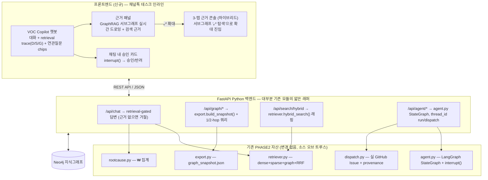

# PHASE 3 PLAN — VOC Copilot: 운영자 인라인 GraphRAG 챗봇 & 근거 콘솔 (Reviewed)

> 원 제안서("[PHASE 3] 엔터프라이즈 루트원인 GraphRAG 웹 애플리케이션 및 학습용 노드북 구축 계획")를 현재 PHASE2 코드베이스(`src/graph/*`, `out/*`, 배포된 Vercel 정적 사이트)와 대조 검증하고, **2026-07-28 브레인스토밍으로 프론트엔드 방향을 챗봇으로 피벗**한 버전. `PHASE2_DASHBOARD_PLAN.md`의 리뷰 방식(§0 Review corrections)을 따른다.
>
> **핵심 피벗(2026-07-28)**: 프론트엔드를 "3-탭 React SPA"에서 **채널톡 데스크 안에 사는 내부 운영자 코파일럿 챗봇**으로 바꾼다. 채널톡 자체가 채팅 플랫폼이므로 대화형 표면이 플랫폼 네이티브하고, **백엔드는 100% 그대로 재사용**(챗봇은 기존 API 위의 다른 스킨)하므로 3-탭 SPA보다 오히려 작업량이 적다. 단, 챗봇이 Phase 2의 정교함(그래프·하이브리드 서치·정직한 근거)을 **숨기면** 손해이므로 — 근거 서브그래프·검색 arm(D/S/G)·provenance를 **채팅 한 화면 안에서 시각적으로 노출**하는 것이 설계의 중심이다.
>
> **결론 요약**: 원안의 탭 2/탭 3 백엔드 기능은 이미 PHASE2에 구현되어 있다. 신규로 필요한 것은 (a) 그 기능들을 HTTP API로 감싸는 얇은 레이어, (b) 챗봇 프론트엔드(대화 + 근거 패널) + 하이브리드로 이어지는 3-탭 근거 콘솔, (c) LangGraph `interrupt()`를 상태 없는 HTTP 요청·응답 주기에 매핑하는 설계, (d) **retrieval-gated generation**(근거 없으면 거절, 경계선이면 확신 낮음 경고), (e) **디자인 시스템 토큰화**(그라데이션 제거).
>
> **목업(방향 확정 산출물)**: [`out/phase3_chatbot_mockup.html`](../../out/phase3_chatbot_mockup.html)(챗봇 코파일럿, 메인), [`out/phase3_mockup.html`](../../out/phase3_mockup.html)(3-탭 근거 콘솔, 하이브리드 확대 대상).

---

## 0. Review corrections (원안 vs 현재 코드베이스 실측)

> 이 표의 백엔드 결론은 프론트엔드 피벗과 무관하게 **전부 유효**하다 — 챗봇도 3-탭 SPA도 아래 동일한 기존 모듈(`retriever`/`agent`/`rootcause`/`export`/`dispatch`)을 재사용한다.

| # | 원안 주장 | 실측 사실 | 결정/조치 |
| :-- | :-- | :-- | :-- |
| 1 | `POST /api/search/hybrid`를 **[NEW]**로 구현 | [`src/graph/retriever.py`](../graph/retriever.py)의 `hybrid_search()`가 이미 dense(fastembed 384d) + sparse(Neo4j full-text/Lucene BM25) + graph(1-hop) + **RRF 융합**을 전부 구현·검증된 상태(`k=60` RRF, `arms`/`rrf` 필드 포함) | `/api/search/hybrid` 라우터는 `hybrid_search()`를 감싸는 **얇은 어댑터**로 재정의. 챗봇 답변의 근거 검색도 이 함수를 그대로 호출 |
| 2 | `src/server/main.py`를 **[NEW]** FastAPI 엔트리포인트로 신설 | [`src/graph/serve.py`](../graph/serve.py)가 이미 라이브 서치 엔드포인트(`POST /search`, `GET /health`, stdlib `http.server`, CORS 포함)이며, `pyproject.toml`의 `[tool.vercel].entrypoint`로 등록된 실제 배포 진입점 | **[확정]** `serve.py`를 FastAPI로 마이그레이션. 기존 라우트를 옮기고 신규 `/api/chat`, `/api/graph`, `/api/agent` 라우터를 같은 앱에 추가. 진입점은 항상 1개 |
| 3 | `POST /api/agent/dispatch`가 "LangGraph 승인 게이트 수신"을 **[NEW]**로 처리 | [`src/graph/agent.py`](../graph/agent.py)에 완전한 `StateGraph` + `SqliteSaver` checkpointer + 실제 `interrupt()`/`Command(resume=...)` 승인 노드가 이미 존재. 현재는 단일 동기 프로세스 안에서만 interrupt→resume | **[확정]** `SqliteSaver`를 **Neo4j 기반 커스텀 `BaseCheckpointSaver`**로 교체. `POST /api/agent/run`이 그래프 시작→`thread_id`+interrupt payload 반환, `POST /api/agent/dispatch`가 결정 수신→`Command(resume=decision)` 재개. 챗봇에서는 이 payload가 **채팅 내 승인 카드**로 렌더된다. 상세 §5-3 |
| 4 | `GET /api/graph/subgraph` (노드/엣지, 1/2-hop 확장)를 **[NEW]**로 설계 | [`src/graph/export.py`](../graph/export.py)의 `build_snapshot()`이 이미 동일 셰이프(`nodes`, `edges`, `root_causes` + ₩/hypothesis/frequency)를 생성 중 | `build_snapshot()` 재사용. **1/2-hop 클릭 확장**은 신규 Cypher(§0-9). 챗봇에서는 답변 옆 **근거 서브그래프 패널**이 이 응답을 그리고, "⤢ 탐색"으로 3-탭 콘솔의 전체 그래프 탐색에 진입 |
| 5 | 웹 대시보드를 Vite+React+Cytoscape.js+Tailwind SPA로 전환 | 현재 라이브 산출물은 빌드·의존성 0인 자립형 단일 HTML(`out/dashboard.html`) | **[확정]** 기존 정적 대시보드(벤치마크 서사) 유지. 신규 웹앱은 **챗봇 코파일럿**을 메인으로, 3-탭 근거 콘솔을 하이브리드 확대 표면으로 병행 서비스 추가 |
| 6 | 배포 계획 없음 | 현재 프로덕션은 100% 정적. FastAPI 앱은 장수명 프로세스 필요 | **[확정]** checkpointer를 Neo4j로 옮겼으므로(행 3) 로컬 디스크 요건 소멸 → **완전 무료 서버리스 호스트 아무 곳**에 배포 가능 |
| 7 | 의존성 언급 없음 | `pyproject.toml`에 `fastapi`/`uvicorn` 없음, `web/` 없음 | 선행 blocker 섹션(§6) |
| 8 | 3개 탭에 PHASE2의 "정직한 벤치마크"(sklearn vs LLM κ) 미언급 | `out/benchmark.json`이 기존 대시보드/README의 핵심 증거 | **[확정]** Phase 3 범위 밖. 벤치마크는 기존 정적 대시보드에만 유지 |
| 9 | 신규 그래프 엔드포인트에 Cypher/데이터 계약 명세 없음 | 원안은 산문뿐 | 각 엔드포인트에 요청/응답 JSON 스키마 + 실제 `MATCH ... -[r*1..2]-` Cypher를 착수 전 명시 |

---

## 1. 아키텍처 (챗봇 피벗 반영)

---

## 2. 프론트엔드 화면 명세 (챗봇 코파일럿)

목업: [`out/phase3_chatbot_mockup.html`](../../out/phase3_chatbot_mockup.html). 좌측 대화 / 우측 근거 패널 2단 레이아웃.

### 2.1 대화 스트림 (좌측)
- **운영자 질문 → 코파일럿 답변**. 답변 생성 전 **retrieval trace**(D=Dense · S=Sparse · G=Graph arm이 순차 점등)로 어떤 검색 갈래가 근거를 잡았는지 보여준다. `retriever.hybrid_search()`의 `arms` 필드를 그대로 시각화.
- 답변은 실제 그래프 값으로 구성(예: rc_support 419건, 위험 ₩6,454,800, 회수 가능 ₩2,259,180, confidence 0.88).
- **인라인 링크(cite) 클릭 = 후속 질문으로 드릴다운**. 답변 속 루트원인·증상·대화 ID를 클릭하면 "그 내용을 채팅으로 물어본 것"으로 처리되어 대화가 이어진다(예: Top3 답변에서 `rc_support` 클릭 → "rc_support 근거 대화 보여줘"가 입력된 것과 동일). 그래프를 **대화로 순회**하는 것이 핵심 UX.
- **연관 질문 chips 항상 표시**: 답변마다 하단 "연관 질문" 영역에 맥락형 후속 질문을 갱신해 노출(예: 손실 Top3 답변 뒤 → rc별 상세 chips). 첫 화면부터 비어 있지 않게 시드 chips 제공.

### 2.2 근거 패널 (우측) — GraphRAG 가시화
- 답변에 반응해 **근거 서브그래프가 실시간으로 그려짐**(엣지 stroke 애니메이션 → 노드 fade-in). `GET /api/graph/subgraph` 응답을 렌더.
- 하단 **검색된 근거 리스트**: 각 근거에 D/S/G arm 태그 + 점수(dense cos-sim, bm25, hop). RRF 융합 전 원자료를 노출해 "왜 이 답이 나왔는지" 추적 가능.
- 헤더 **"⤢ 탐색"** → 3-탭 근거 콘솔([`out/phase3_mockup.html`](../../out/phase3_mockup.html))로 확대 진입(하이브리드, §5-5). 챗봇은 요약·행동, 콘솔은 온톨로지 전체 탐색·3-컬럼 파이프라인 정밀 비교를 담당.

### 2.3 채팅 내 승인 게이트 (interrupt-in-chat)
- 루트원인 요약 답변 끝에 **LangGraph `interrupt()` 승인 카드**가 인라인으로 뜬다: 액션(GitHub Issue 발행), 대상 루트원인, `thread_id`, 회수 가능 손실 표시 + [승인] [반려].
- [승인] → `POST /api/agent/dispatch`(`thread_id`+approve) → `Command(resume=approve)` → `dispatch.dispatch_issue()` → "Issue #142 opened" + provenance 엣지 기록 표시.
- [반려] → `Command(resume=reject)`, 그래프 상태 보존.
- 이 **interrupt→resume-in-chat**가 데모의 하이라이트다("답하는 봇"이 아니라 "행동하는 봇").

### 2.4 Retrieval-gated generation (신뢰도 게이트) — §5-6
- **0 hits(임계값 미만)**: 답을 지어내지 않고 **정직하게 거절** — "VOC 지식그래프에 근거가 없어 답할 수 없어요" + 답할 수 있는 질문 chips 제안. 근거 패널은 "0 hits · 답변 생성 차단".
- **경계선(약한 근거)**: **⚠ 확신 낮음** 경고 배너(confidence 표기) + 헤지된 답변("N건뿐, 임계값 미만, 참고용") + **재질문 유도 chips**. 승격 임계값(`ROOTCAUSE_MIN_CONVERSATIONS=8`)을 그대로 신뢰 경계로 사용.

### 2.5 3-탭 근거 콘솔 (하이브리드 확대 표면)
목업: [`out/phase3_mockup.html`](../../out/phase3_mockup.html). 챗봇에서 "⤢ 탐색"으로 진입하는 정밀 도구.
- **탭 1 온톨로지 탐색**: Customer→Conversation→Symptom→Component→RootCause→Action. 노드 클릭 1/2-hop 확장(신규 Cypher §0-9).
- **탭 2 3-컬럼 하이브리드 서치**: Dense / Sparse BM25 / Graph → RRF. `hybrid_search()`의 `arms`/`rrf` 그대로.
- **탭 3 루트원인 승인 센터**: `rootcause.compute()` 집계 + 카드형 일괄 승인/반려.

---

## 3. 제안 변경 사항 (라벨: WRAP / MODIFY / NEW)

### 3.1 백엔드 (FastAPI Server)
- **[MODIFY→마이그레이션]** `src/graph/serve.py`: stdlib `http.server` → FastAPI. 기존 `/search`,`/health` 이전(회귀 테스트 필수 — 정적 대시보드 플레이그라운드가 의존). 진입점 1개.
- **[WRAP]** `src/server/routers/search.py`: `POST /api/search/hybrid` → `retriever.hybrid_search(query,k)`.
- **[NEW]** `src/server/routers/chat.py`: `POST /api/chat` → hybrid_search로 근거 조회 → **retrieval-gated**(상위 RRF 점수 임계값 판정: 미만=거절, 경계=확신 낮음, 충분=근거 컨텍스트로 답변 생성). 응답에 답변 텍스트 + 근거 arms + 서브그래프 참조 + (해당 시)interrupt payload 포함.
- **[WRAP+NEW]** `src/server/routers/graph.py`: `GET /api/graph/schema`(정적 메타), `GET /api/graph/subgraph?expand=<id>&hops=1|2`(신규 Cypher §0-9).
- **[WRAP+신규 설계]** `src/server/routers/agent.py`: `GET /api/agent/rootcauses`→`rootcause.compute(write=False)`; `POST /api/agent/run`(그래프 시작, `thread_id`+interrupt 반환); `POST /api/agent/dispatch`(`thread_id`+결정→resume→dispatch).
- **[NEW]** `src/graph/checkpoint_neo4j.py`: LangGraph `BaseCheckpointSaver` 구현(§5-3).

### 3.2 프론트엔드 (신규)
- 챗봇 코파일럿 SPA(`web/`). 대화 스트림, 근거 패널(서브그래프 드로잉 + 근거 리스트), 채팅 내 승인 카드, 연관질문 chips, retrieval trace. Cytoscape.js는 근거 패널/3-탭 콘솔 그래프에 사용.
- 3-탭 근거 콘솔(하이브리드 확대 표면).
- **디자인 시스템 토큰(§5-7)을 먼저 확정한 뒤** 컴포넌트 구현. 목업의 그라데이션은 제거(AI slop) — 솔리드 토큰만 사용.

### 3.3 학습용 노트북
- `study/KG_P3_voc_graphrag_tutorial.ipynb`(신규). 기존 명명 규칙 `KG_P{phase}_{순번}_{주제}` 참고. 내용은 기존 모듈을 노트북 셀에서 import·실행하며 설명(온톨로지·3중 하이브리드·RRF·LangGraph 승인·retrieval gating).

---

## 4. 검증 계획

### 자동화
- `pytest`: `/api/chat`(근거 충분→답변 / 0 hits→거절 / 경계→확신 낮음 3분기), `/api/graph/*`, `/api/search/hybrid`, `/api/agent/*` — 특히 `/api/agent/run`→interrupt 수신→`/api/agent/dispatch`(`thread_id`)→resume 성공까지 **왕복 시나리오**(checkpointer 재개 정합성).
- `jupyter execute study/KG_P3_voc_graphrag_tutorial.ipynb` — 셀 에러 없이 실행.
- 회귀: 기존 `python -m src.graph.run` 파이프라인과 `out/dashboard.html`이 Phase 3 이후에도 유지되는지.

### 수동 검증 (웹 브라우저)
- 챗봇: 정상 질문→근거 서브그래프+답변, cite 클릭→드릴다운, 관련 없는 질문→정직한 거절, 경계 질문→확신 낮음 경고+재질문 chips, 승인 카드→Issue 발행.
- 승인 게이트를 **두 번째 요청/콜드스타트 시뮬레이션**으로 재개해도 정상 동작(§0-6/§0-3 상태 관리 리스크 실검증).
- "⤢ 탐색" → 3-탭 콘솔 진입.

---

## 5. 확정된 결정

### 5-1. 배포 모델 → 정적 사이트 유지 + 병행 서비스 추가 (2026-07-28)
`out/dashboard.html` Vercel 정적 배포 유지(벤치마크 서사). 챗봇+콘솔은 별도 URL/서브도메인 병행 서비스로 추가.

### 5-2. 서버 진입점 → `serve.py`를 FastAPI로 마이그레이션 (2026-07-28)
기존 라우트 이전 + 신규 `/api/chat`,`/api/graph`,`/api/agent` 같은 앱에 추가. 진입점 1개, vercel entrypoint 재사용.

### 5-3. LangGraph checkpointer → Neo4j 기반 커스텀 `BaseCheckpointSaver` (2026-07-28)
로컬 `SqliteSaver`는 상시 구동+영구 디스크 필요(무료 티어 유휴 시 유실). Neo4j Aura는 상시 관리형이므로 checkpoint를 여기로 옮기면 로컬 디스크 요건 소멸 → 아무 무료 서버리스 호스트에 배포 가능.
**구현**(`src/graph/checkpoint_neo4j.py`): `put`/`put_writes`/`get_tuple`/`list`(+async) 구현. 노드 `(:AgentCheckpoint {thread_id, checkpoint_ns, checkpoint_id, parent_checkpoint_id, ts, checkpoint_blob, metadata_blob})`, blob은 LangGraph 직렬화 결과 Base64. `thread_id`+`checkpoint_ns`로 최신 1건, `list()`는 parent 체인 페이지네이션. `schema.cypher`에 `thread_id+checkpoint_id` 유니크 제약 추가, 온톨로지 다이어그램엔 미노출.
**첫 스파이크**: `put`→`get_tuple` 왕복 + `interrupt()`→프로세스 재시작→`Command(resume=...)` 재개가 실제 동작하는지 먼저 검증. 실패 시 이 결정 재검토.

### 5-4. 벤치마크 서사 → Phase 3 범위 밖 (2026-07-28)
sklearn vs LLM κ 비교는 기존 정적 대시보드/README에만 유지. 새 웹앱은 실시간 탐색·검색·승인 운영 도구로 목적 축소.

### 5-5. 프론트엔드 방향 → 챗봇 코파일럿 + 3-탭 콘솔 하이브리드 (2026-07-28, 브레인스토밍 확정)
메인은 채널톡 데스크 인라인 **내부 운영자 코파일럿 챗봇**. 근거 서브그래프의 "⤢ 탐색"으로 **3-탭 근거 콘솔**에 확대 진입(정밀 온톨로지 탐색·3-컬럼 파이프라인·일괄 승인). 백엔드 공유라 하이브리드 비용 저렴. 챗봇=요약·행동·접근성, 콘솔=정밀·전수 탐색. **근거(서브그래프·arm·provenance)를 채팅에서 숨기지 않는 것**이 챗봇 차별화의 조건.

### 5-6. 신뢰도 게이트 → Retrieval-gated generation (2026-07-28, 브레인스토밍 확정)
- **0 hits**: 답 생성 차단, 정직한 거절 + 답 가능한 질문 chips. (할루시네이션 방지 = 그래프 기반임을 심사에서 증명하는 강점)
- **경계선**: ⚠ 확신 낮음 경고(confidence 표기) + 헤지 답변 + 재질문 유도 chips.
- 임계값은 `ROOTCAUSE_MIN_CONVERSATIONS=8` 및 RRF 상위 점수 컷오프로 정의(착수 시 수치 튜닝).

### 5-7. 디자인 시스템 → 토큰 별도 생성 후 진행 (2026-07-28, 브레인스토밍 확정)
- 목업의 **그라데이션은 전부 제거**(AI slop 회피) — 솔리드 색 토큰만 사용.
- 색/타이포/간격/모션을 **디자인 토큰으로 별도 생성**(design-consultation 또는 DESIGN.md)한 뒤 그것을 소스 오브 트루스로 컴포넌트 구현. 기존 정적 대시보드의 웜 팔레트(`--bg`,`--ink`,severity 색)를 계승하되 다크 운영 콘솔 톤으로 확장.
- **선행 작업**: 프론트 컴포넌트 착수 전 토큰 확정(§6 blocker).

---

## 6. 선행 blocker (구현 착수 전 필요)

- ~~§5의 4개 결정 확정~~ — 2026-07-28 완료.
- ~~프론트엔드 방향(챗봇/하이브리드)·신뢰도 게이트·디자인 방침 확정~~ — 2026-07-28 브레인스토밍 완료.
- **디자인 시스템 토큰 생성(§5-7)**: 그라데이션 제거·토큰화한 DESIGN.md/토큰 파일. 프론트 컴포넌트보다 먼저.
- **`Neo4jCheckpointSaver` 스파이크 검증(§5-3)**: 나머지 백엔드보다 먼저. 실패 시 §5-3 재검토.
- `pyproject.toml`에 `fastapi`, `uvicorn` 추가.
- `web/` 스캐폴딩(`npm create vite@latest`, `cytoscape`, `react-cytoscapejs`, `lucide-react`, `tailwindcss` — 단, 토큰은 §5-7 우선).
- ~~무료 서버리스 호스트 선정~~ — **[확정] Vercel Python 함수** 사용(§5-3으로 로컬 디스크 제약 소멸). 기존 `pyproject.toml`의 `[tool.vercel].entrypoint`(serve.py)를 그대로 재사용하고, 프론트(Vite/React)도 같은 Vercel 프로젝트에 배포해 관리 단순화. 콜드스타트 간 `thread_id` 재개는 Neo4j checkpointer가 보장.
- 기존 `.env`(`OPENROUTER_API_KEY`, `NEO4J_*`) 재사용 — 신규 시크릿 없음.

---

## 7. 결정 로그

- 2026-07-28: 원안 리뷰 완료. 탭 2/탭 3 백엔드 로직은 PHASE2에 이미 구현됨 확인 — API 래핑으로 범위 재정의.
- 2026-07-28: LangGraph `interrupt()`의 상태 없는 HTTP 매핑(`thread_id` run/dispatch 분리)이 필수 설계 요소로 식별.
- 2026-07-28: 정적 HTML→서버 앱 전환이 배포 아키텍처 변경 수반 확인.
- 2026-07-28 (인터뷰): 배포=정적 유지+병행 추가, 진입점=`serve.py`→FastAPI, checkpointer=Neo4j 커스텀 `BaseCheckpointSaver`, 벤치마크=범위 밖.
- 2026-07-28 (브레인스토밍 피벗): **프론트엔드=운영자 코파일럿 챗봇 + 3-탭 콘솔 하이브리드**(§5-5). 근거를 채팅에서 시각화(서브그래프·arm·provenance)하는 것이 차별화 조건. cite 클릭=드릴다운, 연관질문 chips 항상 표시.
- 2026-07-28 (브레인스토밍): **retrieval-gated generation**(§5-6) — 0 hits 거절 / 경계선 확신 낮음 경고+재질문 chips. 그래프 기반 신뢰성의 증거.
- 2026-07-28 (브레인스토밍): **디자인 시스템 토큰화**(§5-7) — 그라데이션 제거(AI slop), 토큰 별도 생성 후 컴포넌트 착수.
- 2026-07-28: 방향 확정 목업 2종 작성 — `out/phase3_chatbot_mockup.html`(챗봇), `out/phase3_mockup.html`(3-탭 콘솔).
- 2026-07-28: **배포 호스트 = Vercel Python 함수 확정**(§6). 기존 vercel entrypoint 재사용, 프론트도 동일 Vercel 프로젝트에 배포.
