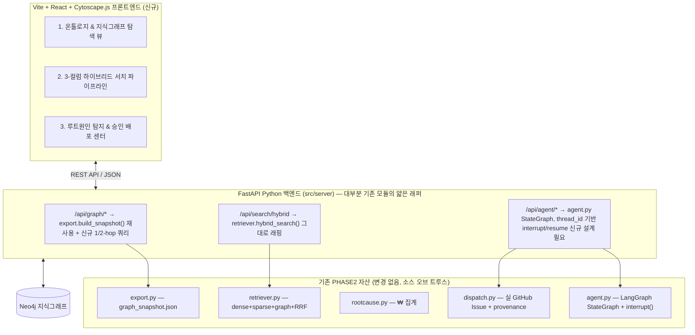

# PHASE 3 PLAN — 엔터프라이즈 루트원인 GraphRAG 웹 애플리케이션 & 학습용 노트북 (Reviewed)

> 원 제안서("[PHASE 3] 엔터프라이즈 루트원인 GraphRAG 웹 애플리케이션 및 학습용 노드북 구축 계획")를 현재 PHASE2 코드베이스(`src/graph/*`, `out/*`, 배포된 Vercel 정적 사이트)와 대조 검증한 결과를 반영한 버전. `PHASE2_DASHBOARD_PLAN.md`의 리뷰 방식(§0 Review corrections)을 따른다.
>
> **결론 요약**: 원안의 탭 2/탭 3 백엔드 기능은 이미 PHASE2에 구현되어 있다. 신규로 필요한 것은 (a) 그 기능들을 HTTP API로 감싸는 얇은 레이어, (b) 정적 HTML → SPA 전환에 따른 **배포 아키텍처 결정**, (c) LangGraph `interrupt()`를 상태 없는 HTTP 요청·응답 주기에 매핑하는 설계. 원안은 이 세 가지를 다루지 않는다.
>
> **2026-07-28 인터뷰로 4개 핵심 결정 확정** — §5 참조. 요약: 정적 대시보드는 유지하고 FastAPI+React를 병행 서비스로 추가하며, `serve.py`를 FastAPI로 마이그레이션하고, LangGraph checkpointer는 Neo4j 기반으로 새로 구현해 완전 무료 서버리스 호스트에 배포하며, 벤치마크(κ) 서사는 Phase 3 범위 밖으로 둔다.

---

## 0. Review corrections (원안 vs 현재 코드베이스 실측)

| # | 원안 주장 | 실측 사실 | 결정/조치 |
| :-- | :-- | :-- | :-- |
| 1 | `POST /api/search/hybrid`를 **[NEW]**로 구현 | [`src/graph/retriever.py`](../graph/retriever.py)의 `hybrid_search()`가 이미 dense(fastembed 384d) + sparse(Neo4j full-text/Lucene BM25) + graph(1-hop) + **RRF 융합**을 전부 구현·검증된 상태(`k=60` RRF, `intermediate_steps`에 해당하는 `arms`/`rrf` 필드 포함) | `/api/search/hybrid` 라우터는 `hybrid_search()`를 감싸는 **얇은 어댑터**로 재정의. "신규 구현"이 아니라 "기존 함수의 HTTP 노출"로 범위 축소 |
| 2 | `src/server/main.py`를 **[NEW]** FastAPI 엔트리포인트로 신설 | [`src/graph/serve.py`](../graph/serve.py)가 이미 라이브 서치 엔드포인트(`POST /search`, `GET /health`, stdlib `http.server`, CORS 포함)이며, `pyproject.toml`의 `[tool.vercel].entrypoint`로 등록된 실제 배포 진입점 | **[확정]** `serve.py`를 FastAPI로 마이그레이션한다. 기존 `/search`, `/health` 라우트를 FastAPI 라우터로 옮기고, 신규 `/api/graph`, `/api/agent` 라우터를 같은 앱에 추가. 진입점은 항상 1개 유지, `pyproject.toml`의 vercel entrypoint도 그대로 재사용 |
| 3 | `POST /api/agent/dispatch`가 "LangGraph 승인 게이트 수신"을 **[NEW]**로 처리 | [`src/graph/agent.py`](../graph/agent.py)에 완전한 `StateGraph` + `SqliteSaver` checkpointer + 실제 `interrupt()`/`Command(resume=...)` 승인 노드가 이미 존재. 단, 현재는 **단일 동기 프로세스**(`python -m src.graph.agent`) 안에서만 interrupt→resume이 일어남 | **[확정]** `SqliteSaver`를 **Neo4j 기반 커스텀 `BaseCheckpointSaver`**로 교체한다. 로컬 디스크 영속성이 필요 없어지므로 완전 무료 서버리스 호스트(Vercel 함수, Render 무료 등) 아무 곳에나 배포 가능. `POST /api/agent/run`이 그래프를 시작해 `thread_id` + interrupt payload를 반환하고, `POST /api/agent/dispatch`가 `thread_id` + 결정을 받아 `Command(resume=decision)`으로 재개. 상세는 §5-3 |
| 4 | `GET /api/graph/subgraph` (Cytoscape용 노드/엣지, 1-hop/2-hop 확장)를 **[NEW]**로 설계 | [`src/graph/export.py`](../graph/export.py)의 `build_snapshot()`이 이미 동일한 셰이프(`nodes`, `edges`, `root_causes` + ₩/hypothesis/frequency)를 `out/graph_snapshot.json`으로 생성 중. 현재 대시보드는 이를 손수 만든 SVG force-graph + Sankey로 렌더링(`dashboard_template.html`, 외부 라이브러리 없음) | `build_snapshot()`을 재사용하되, **1-hop/2-hop 클릭 확장**은 신규 기능(현재 export는 고정된 큐레이션 슬라이스, 쿼리 가능한 확장이 아님) — Cypher 스펙 명시 필요(§0-9) |
| 5 | 웹 대시보드를 Vite + React + Cytoscape.js + TailwindCSS SPA로 전환 | 현재 README/Vercel에 **라이브로 링크된 실제 산출물**은 빌드 스텝·외부 의존성이 0인 **자립형 단일 HTML**(`out/dashboard.html`)이며, `vercel.json`은 `out/*`를 정적 복사만 한다. 이는 PHASE2_PLAN §2.4의 명시적 결정("전부 자립형 HTML — 외부 요청 0, CSP-safe")이었다 | **[확정]** 기존 정적 대시보드는 그대로 유지(README의 Live Dashboard 링크 안 깨짐). FastAPI+React는 **별도 URL/서브도메인의 병행 서비스**로 추가한다. 완전 대체 아님 — 두 산출물이 공존 |
| 6 | 배포 계획 없음 | 현재 프로덕션은 **100% 정적**(Vercel, 서버 런타임 없음). FastAPI 앱은 장수명 프로세스가 필요(Neo4j 드라이버 풀, `interrupt()` 재개용 SqliteSaver 파일). Vercel Python 서버리스 함수는 요청마다 콜드스타트되므로, 로컬 SQLite 체크포인터로는 `thread_id` 기반 재개가 콜드스타트 간에 보존되지 않음 | **[확정]** checkpointer를 Neo4j로 옮겼으므로(행 3) 로컬 디스크 영속성 요건 자체가 사라진다 → **완전 무료 서버리스 호스트 아무 곳**(Vercel Python 함수, Render 무료, Cloud Run 무료 등)에 배포 가능. Fly.io/Oracle Cloud 같은 상시 구동 VM은 불필요 |
| 7 | 의존성 언급 없음 | `pyproject.toml`에 `fastapi`/`uvicorn` 없음, 레포에 `web/` 디렉토리 없음 | PHASE2_PLAN §7과 동일한 "선행 blocker" 섹션 추가 필요(§6) |
| 8 | 3개 탭 어디에도 PHASE2의 "정직한 벤치마크"(sklearn vs LLM κ, `benchmark.py`, README의 핵심 포트폴리오 서사)가 언급되지 않음 | `out/benchmark.json`이 이미 존재하고 현재 대시보드/README의 핵심 증거 자료임 | **[확정]** Phase 3 범위 밖. 벤치마크 서사는 기존 정적 대시보드에만 남긴다. 새 웹앱은 실시간 그래프 탐색·검색·승인 운영 도구로 목적을 좁힌다 |
| 9 | 신규 그래프 엔드포인트 2개에 Cypher/데이터 계약 명세 없음 (PHASE2_PLAN은 모든 단계에 실제 Cypher를 명시한 것과 대조적) | 원안 텍스트는 산문("1-hop/2-hop 확장 지원")뿐 | 구현 착수 전 각 엔드포인트에 요청/응답 JSON 스키마 + 실제 `MATCH ... -[r*1..2]-` Cypher를 `PHASE2_PLAN.md §2.1–2.3` 수준으로 명시 |

---

## 1. 아키텍처 (원안 다이어그램 + 재사용 매핑)

---

## 2. 3개 메인 탭 화면 명세 (원안 유지 + 재사용 주석)

### 탭 1: 온톨로지 & 지식그래프 탐색 뷰
- 온톨로지 스키마: `Customer → Conversation → Symptom → Component → RootCause → Action` (변경 없음, [`schema.cypher`](../graph/schema.cypher)와 동일).
- Cytoscape.js 노드 네트워크: **초기 로드는** `export.build_snapshot()`의 curated slice 재사용 가능. **클릭 시 1/2-hop 확장**은 신규 Cypher 필요(§0-4, §0-9).

### 탭 2: 3-컬럼 하이브리드 서치 파이프라인
- Col 1(Dense) / Col 2(Sparse BM25) / Col 3(Graph 1-2hop) + RRF — **`retriever.hybrid_search()`가 이미 이 4가지를 한 함수 호출로 반환**(`results[].dense/sparse/in_graph/rrf/arms`). 신규 작업은 프론트엔드 3-컬럼 시각화뿐, 백엔드 로직은 재구현 불필요.
- 2-hop 그래프 순회(`[r*1..2]`)는 현재 `retriever.graph_neighbors()`가 1-hop만 지원 — 2-hop 확장은 신규.

### 탭 3: 루트원인 분석 & 인간 승인 배포 센터
- 손실액/중복 지목 통계: `rootcause.compute()`가 이미 `frequency`, `revenue_at_risk_krw`, `projected_recoverable_krw`, `top_symptoms`를 반환(임계값 `ROOTCAUSE_MIN_CONVERSATIONS=8`, 원안의 "8건 이상"과 정확히 일치 — 우연이 아니라 기존 설정값).
- 승인/반려 UI + interrupt 수신: **UI는 신규**, 하지만 뒤에서 호출할 `interrupt()`/`Command(resume=...)` 메커니즘과 `thread_id` 수명주기는 §0-3에서 지적한 설계 공백. 이것부터 확정해야 라우터 구현이 가능.
- GitHub Issue 발행: `dispatch.dispatch_issue()` 그대로 재사용 가능(멱등, provenance 엣지 기록 포함).

---

## 3. 제안 변경 사항 (라벨 정정: NEW → WRAP/MODIFY/NEW 구분)

### 1) 백엔드 (FastAPI Server)

#### [MODIFY→마이그레이션] `src/graph/serve.py`
stdlib `http.server` 핸들러를 FastAPI 앱으로 교체하고 기존 `/search`, `/health` 라우트를 그대로 이전(회귀 테스트 필수 — 정적 대시보드의 라이브 서치 플레이그라운드가 이 엔드포인트에 의존 중). 이후 §3의 신규 라우터들을 같은 앱에 추가. **진입점 1개**로 확정.

#### [WRAP] `src/server/routers/search.py`
- `POST /api/search/hybrid` → `retriever.hybrid_search(query, k)` 그대로 호출. 신규 로직 없음, 응답 스키마만 프론트 요구에 맞게 정리.

#### [WRAP + NEW] `src/server/routers/graph.py`
- `GET /api/graph/schema`: 정적 온톨로지 메타데이터 (신규, 데이터량 적음).
- `GET /api/graph/subgraph`: 기본 응답은 `export.build_snapshot()` 재사용. `?expand=<node_id>&hops=1|2` 파라미터로 신규 Cypher 실행(스펙 명시 필요, §0-9).

#### [WRAP + 신규 설계] `src/server/routers/agent.py`
- `GET /api/agent/rootcauses` → `rootcause.compute(write=False)` 래핑.
- `POST /api/agent/run` (원안에 없던 엔드포인트, **필수 추가**): 그래프 실행 시작, `thread_id` + interrupt payload 반환.
- `POST /api/agent/dispatch`: `thread_id` + 승인/반려 결정 수신 → `Command(resume=...)`로 재개 → `dispatch.dispatch_issue()` 호출.
- `agent.py`의 `SqliteSaver.from_conn_string(...)` 생성 부분을 신규 `Neo4jCheckpointSaver`로 교체(§5-3). `run()` 함수의 시그니처는 유지하되 checkpointer 인스턴스만 주입 전환.

#### [NEW] `src/graph/checkpoint_neo4j.py`
- LangGraph `BaseCheckpointSaver`를 구현하는 신규 모듈. §5-3 참조.

### 2) 프론트엔드 (Vite + React SPA) — 원안 그대로, 변경 없음
- `web/package.json`, `OntologyGraphTab.jsx`, `HybridSearchTab.jsx`, `RootCauseGateTab.jsx` 전부 신규. 이 부분은 실제로 아무 기존 코드와도 겹치지 않는다(현재 대시보드는 React가 아닌 순수 JS/SVG).

### 3) 학습용 노트북
- `study/KG_P3_voc_graphrag_tutorial.ipynb` — 신규. 참고: 기존 `study/KG_P2_04_law_qa.ipynb`, `neo4j-graphrag/KG_P1_01_neo4j_Introduction.ipynb`는 `KG_P{phase}_{순번}_{주제}` 명명 규칙을 쓴다. 일관성을 위해 순번을 넣을지 결정(사소, 강제 아님).
- 내용 자체(온톨로지·3중 하이브리드·RRF·LangGraph 승인)는 **기존 모듈을 그대로 노트북 셀에 import해서 실행**하면 됨 — 새로 구현할 알고리즘은 없음. "직접 구현" 파트는 교육 목적상 의도적으로 재작성하는 것인지, 기존 함수를 호출하며 설명하는 것인지 명확히 할 것.

---

## 4. 검증 계획 (구체화)

### 자동화
- `pytest`: `/api/graph/*`, `/api/search/hybrid`, `/api/agent/*` — 특히 `/api/agent/run` → interrupt payload 수신 → `/api/agent/dispatch`(`thread_id` 포함) → resume 성공까지의 **왕복 시나리오**를 반드시 테스트(단순 200 체크가 아니라 checkpointer 재개 정합성 확인).
- `jupyter execute study/KG_P3_voc_graphrag_tutorial.ipynb` — 셀 에러 없이 실행.
- 회귀 확인: 기존 `python -m src.graph.run` 전체 파이프라인과 `out/dashboard.html`이 Phase 3 작업 이후에도 깨지지 않는지 확인(정적 대시보드를 유지하기로 했다면).

### 수동 검증 (웹 브라우저)
- 원안의 탭 1/2/3 시나리오 유지.
- 추가: 승인 게이트를 **두 번째 브라우저 탭/새 요청**으로 재개해도(=콜드스타트 시뮬레이션) 정상 동작하는지 — §0-6/§0-3의 상태 관리 리스크를 실제로 검증하는 항목.

---

## 5. 확정된 결정 (2026-07-28 인터뷰)

### 5-1. 배포 모델 → **정적 사이트 유지 + 병행 서비스로 추가**
`out/dashboard.html`의 Vercel 정적 배포는 그대로 둔다(README의 Live Dashboard 링크 유지). FastAPI+React는 별도 URL/서브도메인의 새 서비스로 추가한다. 완전 대체 아님 — 두 산출물이 공존하며, 정적 대시보드가 회귀 테스트의 안전망 역할도 겸한다.

### 5-2. 서버 진입점 → **`serve.py`를 FastAPI로 마이그레이션**
기존 `/search`, `/health` 라우트를 FastAPI 라우터로 옮기고, 신규 `/api/graph`, `/api/agent` 라우터를 같은 앱에 추가. 서버 진입점은 항상 1개, `pyproject.toml`의 `[tool.vercel].entrypoint`도 그대로 재사용.

### 5-3. LangGraph checkpointer → **Neo4j 기반 커스텀 `BaseCheckpointSaver`로 교체**
로컬 `SqliteSaver`는 상시 구동 서버 + 영구 디스크가 있어야만 안전하다(무료 티어 대부분은 유휴 시 컨테이너를 완전히 새로 띄우며 로컬 쓰기 내용을 버림 — Render 무료가 대표적). Neo4j Aura는 이미 사용 중이고 상시 접근 가능한 관리형 서비스이므로, checkpoint 상태를 여기로 옮기면 로컬 디스크 영속성 요건이 완전히 사라져 **아무 무료 서버리스 호스트**(Vercel Python 함수, Render 무료, Cloud Run 무료 등)에 배포할 수 있다.

**구현 방향** (`src/graph/checkpoint_neo4j.py`, 신규):
- LangGraph의 `BaseCheckpointSaver` 인터페이스(`put`, `put_writes`, `get_tuple`, `list`, 비동기 버전 `aput`/`aget_tuple`/`alist`)를 구현.
- 신규 노드 레이블 `(:AgentCheckpoint {thread_id, checkpoint_ns, checkpoint_id, parent_checkpoint_id, ts, checkpoint_blob, metadata_blob})` — `checkpoint_blob`/`metadata_blob`은 LangGraph의 기본 직렬화(msgpack/pickle) 결과를 Base64 문자열로 저장(그래프 도메인 데이터가 아닌 불투명 바이트 — 다른 노드 타입과 혼동되지 않도록 별도 레이블 사용).
- 조회는 `thread_id` + `checkpoint_ns`로 최신 `ts` 1건, `list()`는 `parent_checkpoint_id` 체인을 따라가며 페이지네이션.
- **주의**: 이 설계는 "그래프가 system of record"라는 기존 원칙과 방향은 맞지만, `AgentCheckpoint` 자체는 도메인 그래프(Customer→Conversation→...)와 무관한 인프라 데이터다. `src/graph/schema.cypher`에 별도 제약(`thread_id + checkpoint_id` 유니크)만 추가하고, 온톨로지 다이어그램(탭 1)에는 노출하지 않는다.
- 개발 공수가 이 4개 결정 중 가장 크다 — Phase 3 착수 시 첫 스파이크로 별도 검증(단위 테스트: `put`→`get_tuple` 왕복, `interrupt()`→프로세스 재시작→`Command(resume=...)` 재개가 실제로 동작하는지)을 먼저 통과시킬 것.

### 5-4. 벤치마크 서사 → **Phase 3 범위 밖, 기존 정적 대시보드에만 남김**
새 웹앱은 실시간 그래프 탐색·하이브리드 검색·승인 운영 도구로 목적을 좁힌다. sklearn vs LLM κ 비교(`benchmark.py`, `out/benchmark.json`)는 계속 기존 정적 대시보드/README에서만 보여준다.

---

## 6. 선행 blocker (구현 착수 전 필요)

- ~~§5의 4개 결정 항목 확정~~ — 2026-07-28 완료.
- **`Neo4jCheckpointSaver` 스파이크 검증**(§5-3): `put`/`get_tuple` 왕복 + `interrupt()`→재시작→`Command(resume=...)` 재개가 실제로 동작함을 먼저 확인. 이게 실패하면 §5-3 결정 자체를 재검토해야 하므로 나머지 백엔드 작업보다 먼저 진행.
- `pyproject.toml`에 `fastapi`, `uvicorn` 추가.
- `web/` 디렉토리 스캐폴딩(`npm create vite@latest`, `cytoscape`, `react-cytoscapejs`, `lucide-react`, `tailwindcss`).
- 무료 서버리스 호스트 선정(예: Render 무료 웹서비스 또는 Vercel Python 함수) — §5-3으로 로컬 디스크 제약이 사라졌으므로 아무 곳이나 가능, 프론트(Vite/React) 배포 대상과 같은 플랫폼이면 관리가 단순해짐.
- 기존 `.env`(`OPENROUTER_API_KEY`, `NEO4J_*`) 재사용 — 신규 시크릿 없음.

---

## 7. 결정 로그

- 2026-07-28: 원안 리뷰 완료. 탭 2/탭 3 백엔드 로직은 PHASE2에서 이미 구현됨을 확인 — 신규 구현이 아니라 API 래핑으로 범위 재정의.
- 2026-07-28: LangGraph `interrupt()`의 상태 없는 HTTP 매핑(`thread_id` 기반 run/dispatch 분리)이 원안에 없던 필수 설계 요소로 식별됨.
- 2026-07-28: 정적 HTML(Vercel) → FastAPI+React SPA 전환이 배포 아키텍처 변경을 수반함이 확인됨 — §5 결정 전까지 구현 착수 보류 권장.
- 2026-07-28 (인터뷰로 확정): 배포 모델=정적 사이트 유지+병행 서비스 추가, 서버 진입점=`serve.py`→FastAPI 마이그레이션, checkpointer=Neo4j 기반 커스텀 `BaseCheckpointSaver`(완전 무료 서버리스 호스트 어디든 배포 가능해짐), 벤치마크 서사=Phase 3 범위 밖(기존 정적 대시보드 유지). 상세 근거는 §5.
